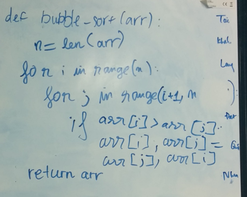
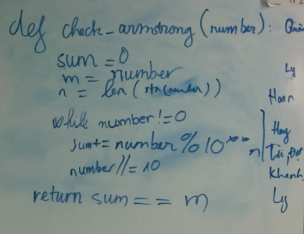
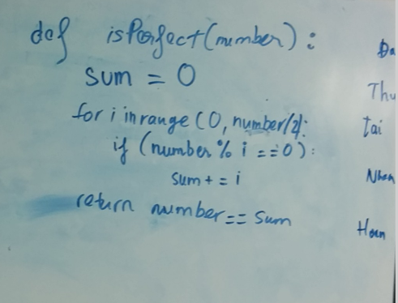
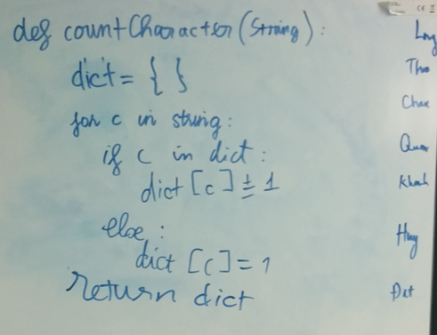
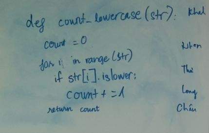
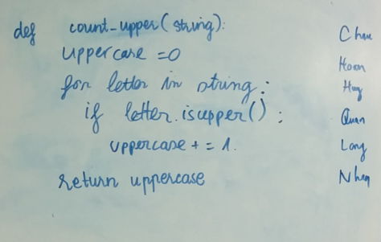
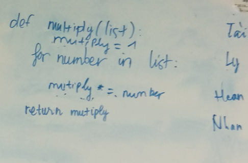
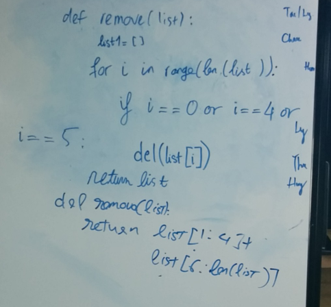
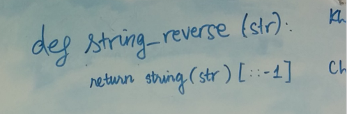
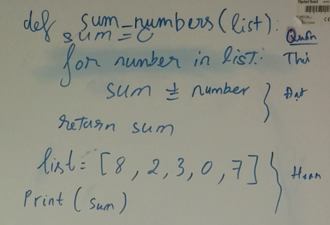

# using_git
Complete the exercises corresponding to the files in the directory [exercise](https://github.com/notelai/using_git/tree/master/exercise)
### bubble_sort.py

### check_armstrong.py

### check_perfect.py

### count_character.py

### count_lowercase.py

### count_upper.py

### multiply_list.py

### remove_list.py

### string_reverse.py

### sum_numbers.py

